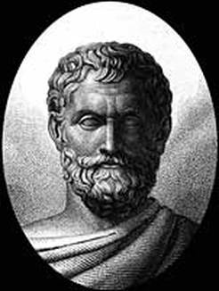
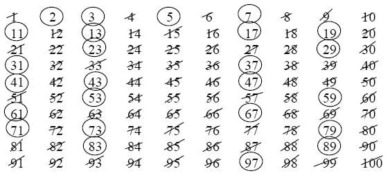
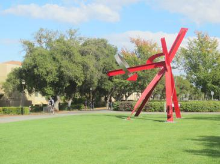

# Eratosthenes

#### This repository is created to describe the life of the famous mathematician Eratosthenes and to describe The Sieve of Eratosthenes  method, a famous study of Eratosthenes used to find prime numbers.

---
#### Contents
* This repository has
    * Life of Eratosthenes
    * Works of Eratosthenes
    * The Sieve of Eratosthenes Method
    * Algorithm
    * The Sieve of Eratosthenes Sculpture

---

## Details

-----

### Life of Eratosthenes



* Eratosthenes was born in Cyrene, Greece in 276 BC, which is now known Libya in North Africa.
  He studied in Athens, but then Ptolemy III, the ruler of Cyrene at the time, appointed Eratosthenes
  head librarian in the Great Library at Alexandria University (now in Egypt).

* The **mathematician** and **astronomer** Eratosthenes is well-known for his technique in finding prime
  numbers called the “Sieve of Eratosthenes” and he is also known for closely approximating the
  circumference of the Sun. When he was about 80 years old, he went blind and because of this blindness
  he decided to starve himself to death.

### Works of Eratosthenes


* Eratosthenes was one of the most pre-eminent scholarly figures of his time, and produced works
  covering a vast area of knowledge before and during his time at the Library. He wrote on many
  topics **geography, mathematics, philosophy, chronology, literary criticism, grammar, poetry,
  and even old comedies.**


* Eratosthenes is revered for his two great contributions in mathematics and astronomy:
  the Sieve of Eratosthenes and measuring the circumference of the Earth. The sieve is
  still used in modern number theory research. His scientific calculations for measuring the
  circumference of the Earth have awarded him with recognition beyond he and his peers could ever
  dream of. His early studies in Geometry helped him see the connections necessary in order for him to
  do what many people behind his time have failed to do.

### The Sieve of Eratosthenes Method

* Eratosthenes proposed a simple algorithm for finding prime numbers. This algorithm is known in
  mathematics as the Sieve of Eratosthenes.



* Let us remember that prime numbers are natural numbers that are only divisible by one and itself. To find these so called primes,
  Eratosthenes propose to write down all known natural numbers starting from the first prime, which is two,
  and above and then “sieving out” every multiple of that prime number, and then moving on to the next prime,
  three, and “sieve out” all the multiples of the new prime which in result cancels out the composite numbers
  and we are left with the primes; this process could continue on forever.

[Click for the animation](https://en.wikipedia.org/wiki/File:Animation_Sieve_of_Eratosth.gif)

### Algorithm

* The sieve of Eratosthenes can be expressed in **pseudocode**, as follows:

```
algorithm Sieve of Eratosthenes is
    input: an integer n > 1.
    output: all prime numbers from 2 through n.

    let A be an array of Boolean values, indexed by integers 2 to n,
    initially all set to true.
    
    for i = 2, 3, 4, ..., not exceeding √n do
        if A[i] is true
            for j = i2, i2+i, i2+2i, i2+3i, ..., not exceeding n do
                set A[j] := false

    return all i such that A[i] is true.
```

### The Sieve of Eratosthenes Sculpture



The Sieve of Eratosthenes is a 1999 sculpture by Mark di Suvero, installed on the Stanford University
campus in Stanford, California, United States.

---

## Installation
Clone the project.
> https://github.com/aslihanhasar/patikaodev01.git

---

## Usage
After cloning the project, open it with the ide you used.

---

## Requirements
* JDK (version 19 is recommended)

---

## Author
**Aslıhan Hasar**

* GitHub: [aslıhanhasar](https://github.com/aslihanhasar)
* LinkedIn: [aslıhanhasar](https://www.linkedin.com/in/asl%C4%B1hanhasar
  )
---

## Contributing
Contributions, issues, and feature requests are welcome.

---

## License

[MIT](https://choosealicense.com/licenses/mit/)

---

## Show Your Suport
Give me a &#11088; if you like the project.

---

## Acknowledgments
* This repository is created for my homework on Patika X Allianz Bootcamp.